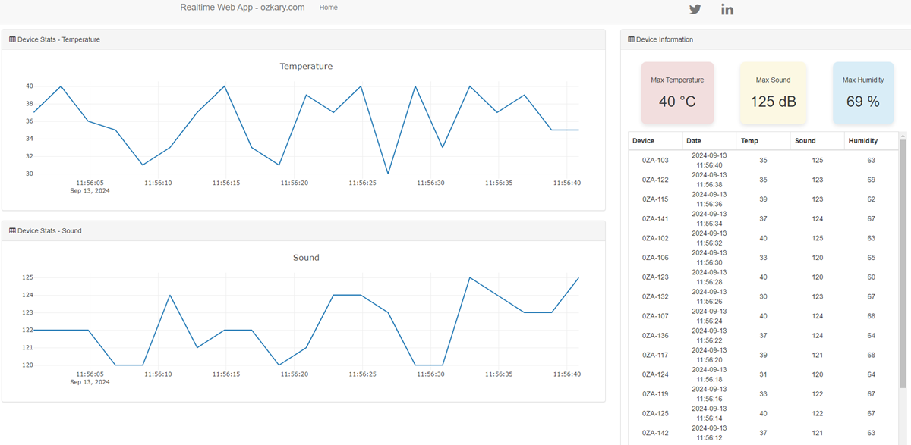
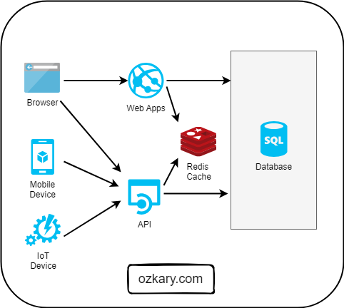

# Real-time Web Apps with Node.js, Angular, Socket.io, and Redis

Dive into the future of web applications with this project! We're moving beyond traditional API polling and embracing real-time integration. Imagine your client app maintaining a persistent connection with the server, enabling bidirectional communication and live data streaming. We'll also tackle scalability challenges and integrate Redis as our in-memory data solution.



### Related Projects

This project is part of the **Data Engineering Process Fundamentals** concepts. For more on data warehouse design with data streaming using Kafka and Spark, check out this repository: [Data Engineering MTA Turnstile](https://github.com/ozkary/data-engineering-mta-turnstile).

> 👉 [Data Engineering Process Fundamental Book on Amazon](https://www.amazon.com/Data-Engineering-Process-Fundamentals-Hands/dp/B0CV7TPSNB "Data Engineering Process Fundamental Book on Amazon by Oscar D. Garcia, ozkary")    

<a href="https://www.amazon.com/Data-Engineering-Process-Fundamentals-Hands/dp/B0CV7TPSNB" target="_amazon">

</a></div>

## Architecture



This diagram illustrates how devices can interact with APIs to send data to a database. Web applications with dashboards can then read information from either the cache or the database, leveraging a **cache-aside pattern**. In this pattern, data is first checked in the Redis cache. If the data is not found (a cache miss), it is retrieved from the database and then stored in the cache for future requests (a cache hit). This approach optimizes performance and data storage efficiency.


## Getting Started

Ready to get your hands dirty? Follow these steps to set up your environment:
- **Install Nodejs version ^20**
- **Install Redis locally.**
- **Clone the repository.**
- **Configure your database.**
- **Run the server and client code:**

    ```bash
    # From the server folder
    npm start

    # From the client folder
    npm start

    # Open your browser and navigate to
    http://localhost:4200
    ```
> This is the client app, which shows the real-team dashboard

- **Test the socket integration:**

    ```bash
    # Open your browser and navigate to
    http://localhost:1338
    ```
> This is a client device tool, which emits telemetry data

### Installing Redis on Bash Locally

Get Redis up and running on your local machine with these simple commands. This will install Redis using the default port number 6379.

```bash
$ sudo apt-get install redis-server -y
$ sudo sed -i -e 's/127.0.0.1/0.0.0.0/g' /etc/redis/redis.conf
$ sudo service redis-server restart
```

Start a session using:

```bash
$ redis-cli
```

Test the service with the following commands:

```bash
> set table:key "{data:'here'}"
> get table:key
```

Add and query data with:

```bash
> zadd table:data 100 "{data:'100'}"
> zadd table:data 200 "{data:'200'}"
> ZRANGEBYSCORE table:data 100 200
```
### Set your database properties 

- Set the type to your SQL database type. see typeorm docs for more information
- If using WSL2 and connecting to a localhost database on Windows
  - Find the gateway ip from WSL2 `ip route` use the value after `default via`
- Set your username, password and database information
   
```js

{   
   "type": "mssql",
   "host": "172.22.32.1",
   "port": 1433,
   "username": "",
   "password": "",
   "database": "",
   "synchronize": false,
   "logging": true,
   "connectionIsolationLevel": "READ_UNCOMMITTED",
   "entities": [
      "models/entity/*.js"
   ],
   "migrations": [
      "models/migration/*.js"
   ],
   "subscribers": [
      "models/subscriber/*.js"
   ],
   "cli": {
      "entitiesDir": "models/entity",
      "migrationsDir": "models/migration",
      "subscribersDir": "models/subscriber"
   },
   "extra": {
    "encrypt": false, 
    "trustServerCertificate": true
  }  
}

```

Get the WSL executable path
$wslPath = Get-Command wsl.exe | Select-Object -ExpandProperty Path


## Built With

* [Visual Studio Code](https://code.visualstudio.com/)
* [Nodejs](https://nodejs.org/)
* [Socket.io](https://socket.io/)
* [Angular](https://angular.io/)
* [TypeScript](https://www.typescriptlang.org/)
* [Rxjs](http://reactivex.io/rxjs/)
* [Redis](https://redis.io/) 
* [Plotly.js](https://plot.ly/javascript/)

## Versioning / Branches

* api    - $ git checkout -b api    - api integration 
* socket - $ git checkout -b socket - socketio integration 
* redis  - $ git checkout -b redis  - redis integration 
* master - $ git checkout -b redis  - final integration
* sqlserver - $ git checkout -b sqlserver  - sql server, typeorm and cache-aside pattern


## ⭐️ Star Realtime Apps with Node.js, Angular, Socket.io, and Redis on GitHub!

If you find this project useful, please consider giving it a ⭐️ on GitHub! Your support helps us grow and reach more developers.

[](https://github.com/ozkary/Realtime-Apps-with-Nodejs-Angular-Socketio-Redis)

**Why Star This Project?**
- Stay updated with the latest features and improvements.
- Show your support for open-source development.
- Help others discover a valuable resource for building real-time applications.

## How to Star This Project
1. Visit the [Realtime Apps with Node.js, Angular, Socket.io, and Redis GitHub Repository](https://github.com/ozkary/Realtime-Apps-with-Nodejs-Angular-Socketio-Redis).
2. Click on the "Star" button in the top-right corner.

Thank you for your support! 🌟


## Contributing
We welcome contributions from the community to enhance and expand this repository. If you have ideas, improvements, or new content to add, please review our [Contribution Guidelines](CONTRIBUTING.md).

## License

This repository is licensed under the [Apache License](LICENSE.md), allowing you to use the code and resources within this repository in your projects.

Happy learning and building!

## Acknowledgments

* **Oscar Garcia** - *Initial work* - [github](https://github.com/ozkary) 
                                      [blog](https://www.ozkary.com) 


